# AI Sequence RAG Pipeline

> **What this is:** A guide to how uploaded pitch documents power AI-generated outreach sequences in Coherent Outreach.

---

## Quick reference

| Item | Value |
|------|--------|
| **UI page** | `/sequences/generate` (+ AI sequence) |
| **Vector DB** | Qdrant (`http://127.0.0.1:6333`) |
| **Embeddings** | `all-MiniLM-L6-v2` (384 dimensions, local) |
| **Generation LLM** | Claude Haiku |
| **Chunks sent to LLM** | Top **5** (from 8 candidates) |
| **Supported files** | PDF, DOCX, TXT, MD (max 20 MB) |

**Start services:**

```powershell
docker compose up qdrant          # vector database
cd backend && .\.venv\Scripts\uvicorn.exe outreach.main:app --reload --port 8000
cd frontend && npm.cmd run dev    # http://localhost:5173
```

**Test files:** [`docs/test-documents/`](test-documents/)

---

## Table of contents

1. [Big picture (30-second read)](#1-big-picture-30-second-read)
2. [System architecture](#2-system-architecture)
3. [Ingest pipeline (upload → vectors)](#3-ingest-pipeline-upload--vectors)
4. [Generate pipeline (prompt → sequence)](#4-generate-pipeline-prompt--sequence)
5. [Retrieval algorithm (top 5 chunks)](#5-retrieval-algorithm-top-5-chunks)
6. [Data model & storage](#6-data-model--storage)
7. [LLM grounding rules](#7-llm-grounding-rules)
8. [API endpoints](#8-api-endpoints)
9. [Frontend flow](#9-frontend-flow)
10. [Configuration](#10-configuration)
11. [Errors & fallbacks](#11-errors--fallbacks)
12. [Testing](#12-testing)
13. [Source files](#13-source-files)
14. [Manual test checklist](#14-manual-test-checklist)

---

## 1. Big picture (30-second read)

```
  YOU                          SYSTEM                         OUTPUT
  ───                          ──────                         ──────

  Upload pitch docs  ──►  Parse → Chunk → Embed → Qdrant
  (PDF/DOCX/TXT/MD)

  Write a prompt     ──►  Search Qdrant → Top 5 chunks  ──►  Draft sequence
  + select docs            + Claude Haiku                    (emails, LinkedIn,
                                                               description)
```

**In plain English:**

1. You upload documents about your product.
2. The system splits them into small overlapping chunks and stores them as vectors.
3. When you ask for a sequence, it finds the 5 most relevant chunks for your prompt.
4. Claude writes the sequence using those chunks as the **only** source of product facts.

**Not included:** Lead follow-up RAG still uses ChromaDB + OpenAI in `vault.py` (separate system).

---

## 2. System architecture

### 2.1 High-level component diagram

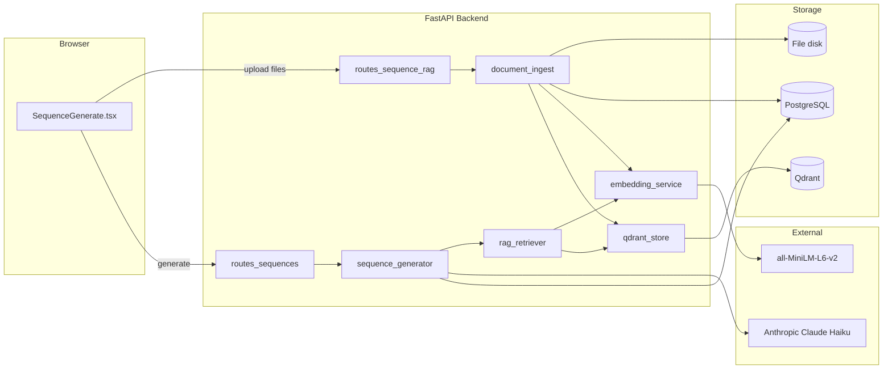

### 2.2 Layered architecture

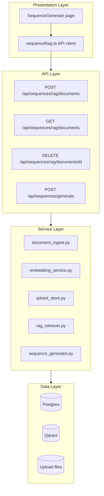

### 2.3 ASCII overview (works everywhere)

```
┌─────────────────────────────────────────────────────────────────────────┐
│                         FRONTEND (React)                                 │
│  /sequences/generate  —  upload docs, write prompt, generate            │
└───────────────────────────────┬─────────────────────────────────────────┘
                                │ HTTP /api
┌───────────────────────────────▼─────────────────────────────────────────┐
│                         BACKEND (FastAPI)                                │
│                                                                          │
│  ┌─────────────────────┐      ┌─────────────────────┐                   │
│  │  INGEST PATH        │      │  GENERATE PATH      │                   │
│  │  document_ingest    │      │  rag_retriever      │                   │
│  │  embedding_service  │      │  sequence_generator │                   │
│  │  qdrant_store       │      │  → Claude Haiku     │                   │
│  └──────────┬──────────┘      └──────────┬──────────┘                   │
└─────────────┼─────────────────────────────┼────────────────────────────┘
              │                             │
    ┌─────────▼─────────┐         ┌─────────▼─────────┐
    │ Qdrant (vectors)  │         │ PostgreSQL        │
    │ + chunk text      │         │ sequences, steps, │
    │                   │         │ rag_documents     │
    └───────────────────┘         └───────────────────┘
              │
    ┌─────────▼─────────┐
    │ Disk uploads/     │
    │ {user_id}/...     │
    └───────────────────┘
```

---

## 3. Ingest pipeline (upload → vectors)

**When:** User selects files on the Generate page and uploads.

**Goal:** Turn each file into searchable vector chunks in Qdrant.

### 3.1 Flow diagram

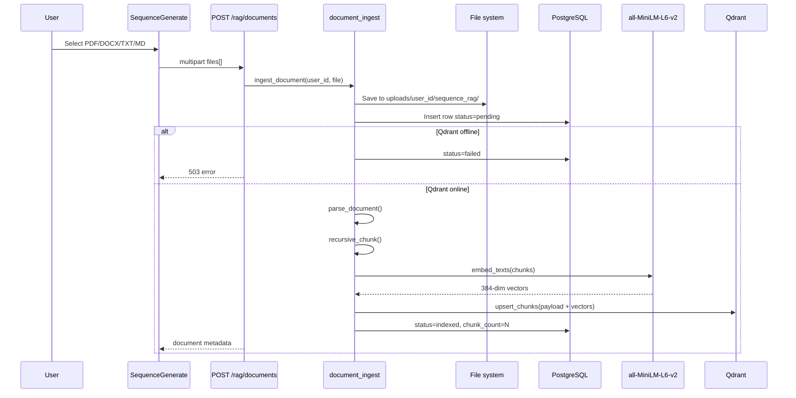

### 3.2 Step-by-step

| Step | What happens | Output |
|:----:|--------------|--------|
| 1 | Validate file type & size (≤ 20 MB) | — |
| 2 | Save raw file to disk | `data/uploads/{user_id}/sequence_rag/{uuid}.ext` |
| 3 | Create DB record | `status = pending` |
| 4 | Extract text (PDF/DOCX/TXT/MD) | Plain text string |
| 5 | **Recursive chunk** (1000 chars, 200 overlap) | List of chunks + metadata |
| 6 | **Embed** all chunks (batch) | 384-dim vectors |
| 7 | **Upsert** to Qdrant | Vectors + payload stored |
| 8 | Update DB | `status = indexed`, `chunk_count = N` |

### 3.3 Chunking detail

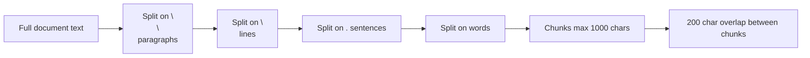

**Each chunk stores:**

- `chunk_index` — position in document (0, 1, 2…)
- `total_chunks` — how many chunks in this file
- `char_start` / `char_end` — location in original text
- `text` — the actual content

**Service file:** `backend/src/outreach/services/document_ingest.py`

---

## 4. Generate pipeline (prompt → sequence)

**When:** User writes a prompt and clicks **Generate sequence**.

**Goal:** Retrieve relevant doc chunks, then have Claude write a grounded draft sequence.

### 4.1 Flow diagram

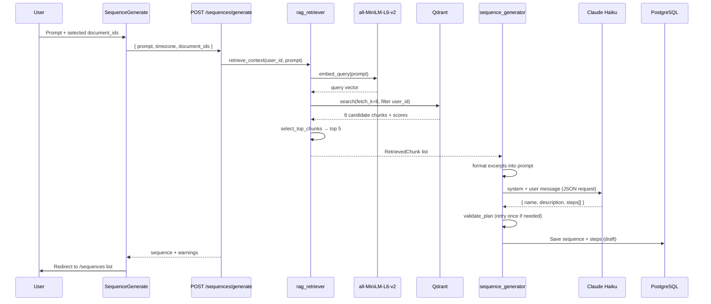

### 4.2 What gets generated

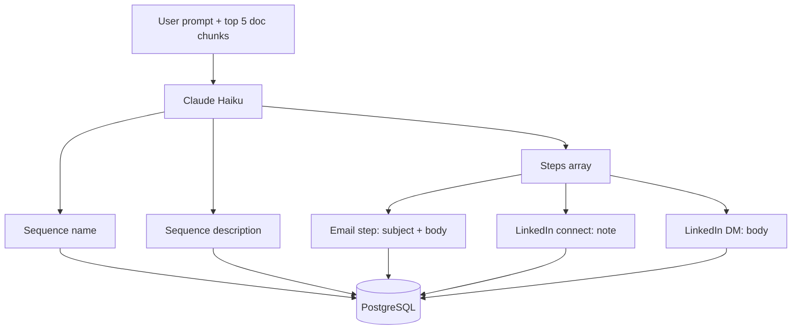

All product facts in **description** and **bodies** should come from the retrieved document excerpts.

**Service files:**

- `backend/src/outreach/services/rag_retriever.py`
- `backend/src/outreach/services/sequence_generator.py`

---

## 5. Retrieval algorithm (top 5 chunks)

**Design goal:** Balance **speed** (one embed + one search) with **accuracy** (filter noise).

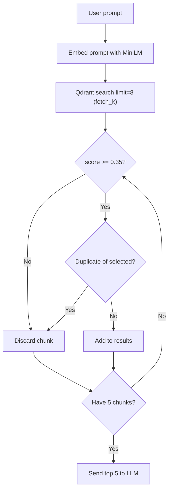

| Setting | Default | Purpose |
|---------|---------|---------|
| `rag_fetch_k` | 8 | How many candidates Qdrant returns |
| `rag_min_score` | 0.35 | Drop weak matches (cosine similarity) |
| `rag_top_k` | 5 | Final chunks injected into LLM prompt |
| Dedupe | prefix check | Skip near-duplicate chunks |

**Example formatted excerpt sent to Claude:**

```
[1] (file: coherent-analytics-pitch.md, relevance: 0.82)
  Coherent Analytics is a developer observability platform...

[2] (file: coherent-analytics-pitch.md, relevance: 0.71)
  Pricing: Starter $299/month, Growth $799/month...
```

---

## 6. Data model & storage

### 6.1 Where data lives

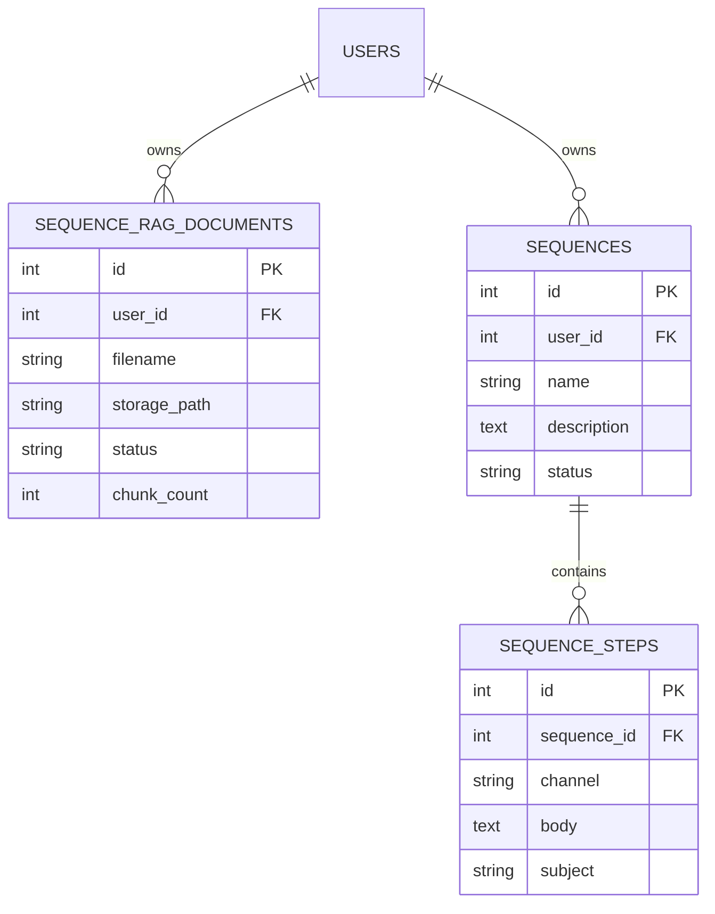

### 6.2 Qdrant point payload

Each vector in collection `sequence_rag_chunks` carries:

| Field | Example | Purpose |
|-------|---------|---------|
| `user_id` | `1` | Tenant isolation (required on every search) |
| `document_id` | `42` | Link back to Postgres row |
| `filename` | `pitch.pdf` | Shown in LLM prompt & warnings |
| `chunk_index` | `0` | Order within document |
| `total_chunks` | `5` | Context for LLM |
| `text` | `"We help teams..."` | Full chunk for retrieval |
| `char_start` / `char_end` | `0`, `987` | Offset in source file |
| `file_type` | `pdf` | Metadata |
| `created_at` | ISO timestamp | Audit |

**Vector:** 384 floats from MiniLM, cosine distance.

### 6.3 User isolation

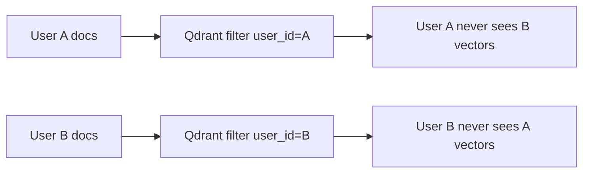

Every search and delete **must** include `user_id` in the Qdrant filter.

---

## 7. LLM grounding rules

### What Claude is told to do

| Output field | Rule |
|--------------|------|
| **Sequence description** | Summarize outreach goal using document excerpts |
| **Email subject + body** | Use value props, proof points, CTA from excerpts |
| **LinkedIn DM / connect note** | Same — grounded in excerpts |
| **Pricing / metrics** | Only if present in excerpts — never invented |

### What Claude returns (JSON)

```json
{
  "name": "Engineering Manager Release Visibility",
  "description": "3-touch outreach about release cycle visibility for eng leaders.",
  "steps": [
    {
      "channel": "email",
      "delay_days": 0,
      "delay_hours": 0,
      "subject": "Quick question about {{company}} releases",
      "body": "Hi {{first_name}}, ..."
    }
  ]
}
```

### Allowed template tokens

`{{first_name}}` · `{{last_name}}` · `{{company}}` · `{{title}}` · `{{email}}`

---

## 8. API endpoints

### Document RAG (`/api/sequences/rag`)

| Method | Path | Description |
|--------|------|-------------|
| **POST** | `/documents` | Upload one or more files (`files[]` multipart) |
| **GET** | `/documents` | List user's uploaded documents |
| **DELETE** | `/documents/{id}` | Delete file + Qdrant vectors |

### Sequence generation

| Method | Path | Body |
|--------|------|------|
| **POST** | `/api/sequences/generate` | `{ prompt, timezone?, document_ids? }` |

**`document_ids` behavior:**

- Omitted or empty → use **all** indexed docs for this user
- `[1, 3]` → retrieve only from those documents

---

## 9. Frontend flow

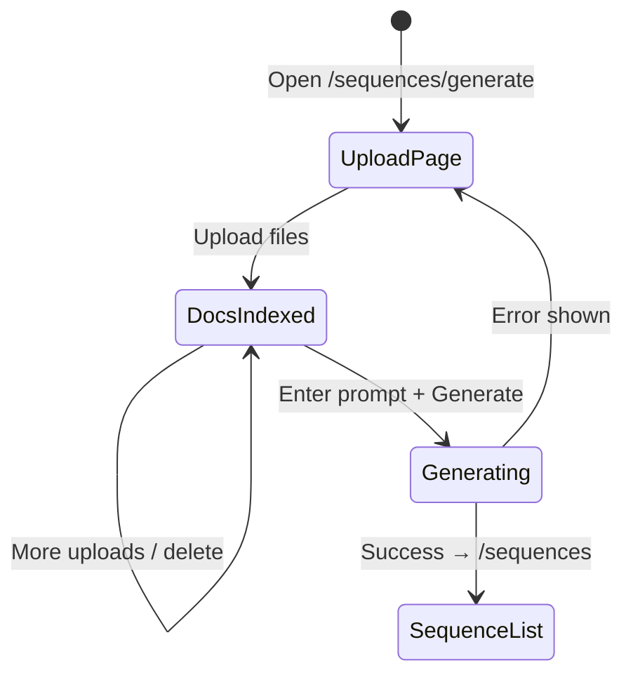

**Key files:**

- Page: `frontend/src/pages/SequenceGenerate.tsx`
- API: `frontend/src/api/sequenceRag.ts`

**UI sections:**

1. **Documents** — file picker, list with status/chunks, checkboxes, delete
2. **Prompt** — textarea (min 10 chars)
3. **Timezone** — default `Asia/Kolkata`
4. **Generate** — calls API with selected `document_ids`

---

## 10. Configuration

Set in `backend/.env` (loaded from `backend/` directory):

```env
# Qdrant
QDRANT_URL=http://127.0.0.1:6333
QDRANT_COLLECTION=sequence_rag_chunks

# Embeddings
EMBEDDING_MODEL=all-MiniLM-L6-v2

# RAG tuning
RAG_CHUNK_SIZE=1000
RAG_CHUNK_OVERLAP=200
RAG_TOP_K=5
RAG_FETCH_K=8
RAG_MIN_SCORE=0.35
RAG_CHUNK_PROMPT_CHARS=600

# Generation (required)
ANTHROPIC_API_KEY=sk-ant-...
```

| If you want… | Change… |
|--------------|---------|
| More context in LLM | Increase `RAG_TOP_K` or `RAG_CHUNK_PROMPT_CHARS` |
| Stricter relevance | Increase `RAG_MIN_SCORE` (e.g. `0.45`) |
| Larger chunks | Increase `RAG_CHUNK_SIZE` |

---

## 11. Errors & fallbacks

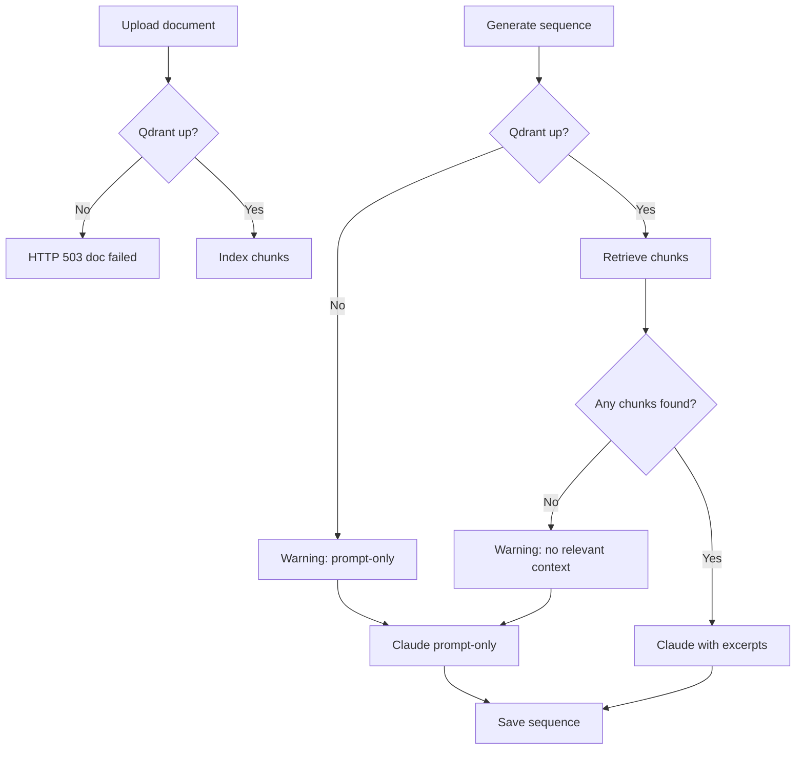

| Situation | Upload | Generate |
|-----------|:------:|:--------:|
| Qdrant down | Fails (503) | Continues (prompt-only) |
| Scanned PDF (no text) | Fails (`failed` status) | — |
| Low relevance chunks | — | Continues (prompt-only + warning) |
| Bad Anthropic key | — | Fails (401) |

---

## 12. Testing

### Automated

```powershell
cd backend
.\.venv\Scripts\pytest.exe tests/ -q
```

| Test file | Covers |
|-----------|--------|
| `tests/test_document_ingest.py` | Chunking, parsing |
| `tests/test_rag_retriever.py` | Top-5 selection, formatting |

### Sample documents

See [`docs/test-documents/README.md`](test-documents/README.md).

---

## 13. Source files

```
backend/src/outreach/
├── config.py                      # RAG_* settings
├── models/sequence_rag_document.py
├── schemas/sequence_rag.py
├── api/
│   ├── routes_sequence_rag.py     # upload / list / delete
│   └── routes_sequences.py        # POST /generate
└── services/
    ├── document_ingest.py         # parse, chunk, index
    ├── embedding_service.py       # MiniLM
    ├── qdrant_store.py            # vector CRUD
    ├── rag_retriever.py           # top-5 retrieval
    └── sequence_generator.py      # Claude + validation

frontend/src/
├── pages/SequenceGenerate.tsx
└── api/sequenceRag.ts

docker-compose.yml                 # Qdrant service
docs/test-documents/               # sample uploads
```

---

## 14. Manual test checklist

- [ ] `docker compose up qdrant` running
- [ ] Backend on `:8000`, frontend on `:5173`
- [ ] `ANTHROPIC_API_KEY` set in `backend/.env`
- [ ] Upload `docs/test-documents/coherent-analytics-pitch.md`
- [ ] Document shows **indexed** with chunk count > 0
- [ ] Generate with prompt mentioning "release visibility"
- [ ] Open sequence — description and emails reference doc facts
- [ ] Optional: upload 2 docs, select both, verify multi-doc retrieval

---

## Related docs

- [Test documents & example prompts](test-documents/README.md)
- [Phase 1 offerings plan (future)](plans/PHASE_1_OFFERINGS.md)
- [Architecture V2 (future)](plans/ARCHITECTURE_V2.md)
